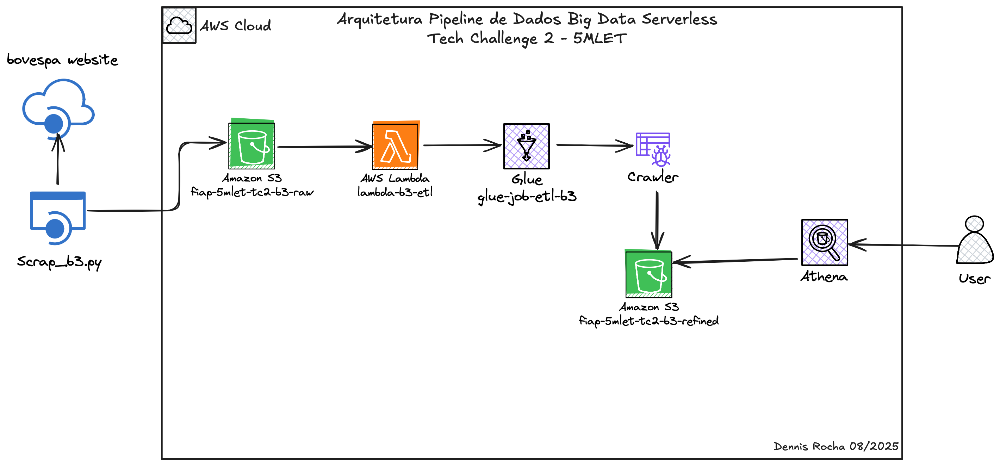

# Tech Challenge - Pipeline Batch Bovespa

Tech Challenge é o projeto da fase que englobará os conhecimentos obtidos em todas as disciplinas da fase.

Pipeline Batch Bovespa: ingestão e arquitetura de dados
Neste projeto deve se construir um pipeline de dados completo para extrair, processar e analisar dados do pregão da B3, utilizando AWS S3, Glue, Lambda e Athena. 

Para esse desafio, sua entrega deve conter os seguintes requisitos:
Requisito 1: scrap de dados do site da B3 com dados do pregão.
Requisito 2: os dados brutos devem ser ingeridos no s3 em formato parquet com partição diária.
Requisito 3: o bucket deve acionar uma lambda, que por sua vez irá chamar o job de ETL no glue.
Requisito 4: a lambda pode ser em qualquer linguagem. Ela apenas deverá iniciar o job Glue.
Requisito 5: o job Glue deve ser feito no modo visual. Este job deve conter as seguintes transformações obrigatórias:
A: agrupamento numérico, sumarização, contagem ou soma.
B: renomear duas colunas existentes além das de agrupamento.
C: realizar um cálculo com campos de data, exemplo, poder ser du-ração, comparação, diferença entre datas.
Requisito 6: os dados refinados no job glue devem ser salvos no formato parquet em uma pasta chamada refined, particionado por data e pelo nome ou abreviação da ação do pregão.
Requisito 7: o job Glue deve automaticamente catalogar o dado no Glue Catalog e criar uma tabela no banco de dados default do Glue Catalog.
Requisito 8: os dados devem estar disponíveis e legíveis no Athena.

---
## Diagrama de Arquitetura

---

5mlet_tc_fase_2/
├── glue/
│   └─  glue-job-stl-b3.py
├── images/
│   └── arquitetura.jpg
├── lambda/
│   └─  glue_trigger.py
├── venv/
├── scrap_b3.py/
├── requirements.txt
└── README.md  

## Requisitos

- **Python 3.7 ou superior**
- **pip** (gerenciador de pacotes)

## Dependências

- **boto3**
- **pandas**
- **requests**
- **pyarrow**

### Autor 👨‍💻
Desenvolvido por: Dennis Rocha. [(Linkedin)](https://www.linkedin.com/in/dennissrocha/)